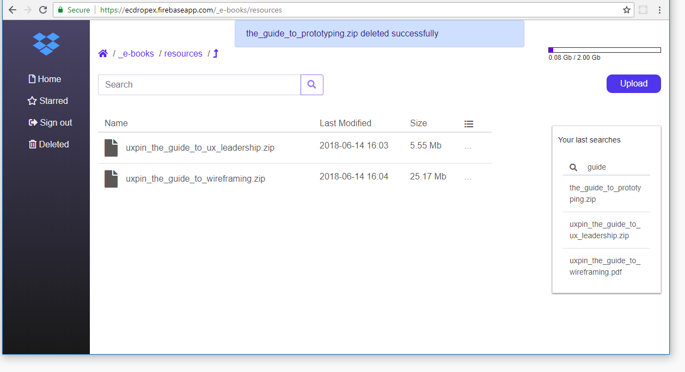

# Dropbox Explorer - DropEx
* Introduction
   * Screenshot and online demo
   * What we used in this project
   * How it works
   * How about your personal information
   * Who we are
* Folder structure
* Using
   * Configuration
   * How you can deploy a cloud function on Google Cloud Platform
   * How you can deploy your app on Google Firebase Hosting
* References
   * Guides
   * Tips

## Introduction
This project was generated with [Angular CLI](https://github.com/angular/angular-cli) v6.0.8. You may want to know about how you can [start this app](ANGULAR.md), view [online demo](https://ecdropex.firebaseapp.com/) and app structure on [sketchboard](https://sketchboard.me/lA0SWJEBeaSJ#/).

You may want to view about these other things in this project:
* [Angular version 6](https://blog.angular.io/version-6-of-angular-now-available-cc56b0efa7a4)  and [RxJS](https://github.com/ReactiveX/rxjs)
* [Dropbox API](https://www.dropbox.com/developers) and [Dropbox webhooks](https://www.dropbox.com/developers/reference/webhooks)
* [AngularFire2](https://github.com/angular/angularfire2)
* [Firebase Realtime Database](https://firebase.google.com/docs/database/)
* [Firebase Hosting](https://firebase.google.com/docs/hosting/)
* [Cloud Functions for Firebase](https://firebase.google.com/docs/functions/)
* [Google Cloud Platform](https://cloud.google.com/)

### Screenshot
* [View online demo here](https://ecdropex.firebaseapp.com)

### What we used in this project
||Version|
|---|---|
|Angular|6.0.9|
|Angular CLI|6.0.8|
|RxJS|6.2.2|
|Dropbox|4.0.9|
|AngularFire2|5.0.0-rc.11|
|Firebase|5.0.4|
|TypeScript|2.7.2|

### How it works
We use OAuth 2 flow and Dropbox take care of all user verification process. ([View more about Dropbox verification process here](https://www.dropbox.com/developers/reference/oauth-guide))

### How about your personal information
We do NOT read, save or collect your personal information and files on Dropbox. NOTHING ALL!

### Who we are
We are a group and we learn about Angular as well as Dropbox API through this project. We would like to share knowledge for everyone else who wants to learn about front-end development.

Visit oss on GitHub ([Kadar](https://github.com/km860), [Nadim](https://github.com/Nalfs), [Khoi](https://github.com/nguyenkhois)) or LinkedIn ([Nadim](https://www.linkedin.com/in/nadim-al-sharif-6522ba14a/), [Khoi](https://www.linkedin.com/in/khoi-le-b5225814b/)).

## Folder structure
|Folder|Description|
|---|---|
|dropex|Main codes|
|webhooks| Using for deployment your functions to Google Cloud Functions|
|deploy| Using for deployment your app to Google Firebase Hosting|

## Using
* Run `npm install` in these folders `/dropex` and `/webhooks/functions` to install all needed packages.

### Configuration
* You need only to change configs in this file `/dropex/src/app/configs.ts` for this app. It include these things
   * Dropbox config
   * Firebase config
* Run `npm start` in this folder `/dropex` to start your local web server at `http://localhost:4200`
* I will close all my servers or change my configs at any time. This project is only using to learn by youself.

## References
### Guides
* [Angular - Deployment](https://angular.io/guide/deployment)
* [Express server](https://expressjs.com/en/4x/api.html)
* [List of HTTP status codes](https://en.wikipedia.org/wiki/List_of_HTTP_status_codes)
* [Dropbox files/list_folder behaviour](https://www.dropboxforum.com/t5/API-Support-Feedback/Dropbox-files-list-folder-behaviour/td-p/232948)
* [Firebase CLI Reference](https://firebase.google.com/docs/cli/)
* [Firebase - Call Functions via HTTP Requests](https://firebase.google.com/docs/functions/http-events#using_express_request_and_response_objects)
* [Content Security Policy (CSP)](https://content-security-policy.com/)

### Tips
* [Introduction To Firebase Cloud Functions](https://medium.com/codingthesmartway-com-blog/introduction-to-firebase-cloud-functions-c220613f0ef)

*(I would continue to update the document ...)*